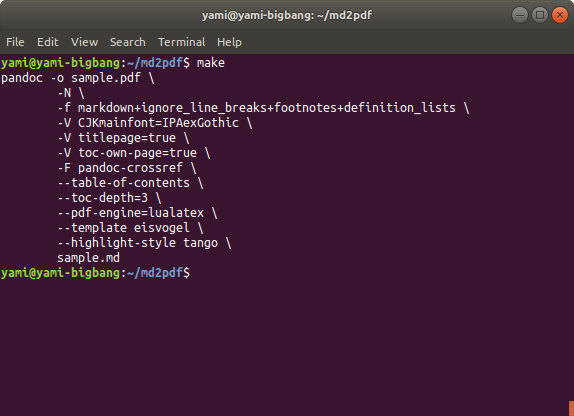

# インストール
```bash
make install
make build
```

# PDF変換
```bash
make
```

実行結果

{#fig:sample-image}

[@fig:sample-image] はサンプルの図です。

サンプルのテキスト [^footnote]

[^footnote]: 実行したよ

\appendix
\clearpage

# 付録Aタイトル

ふろく
